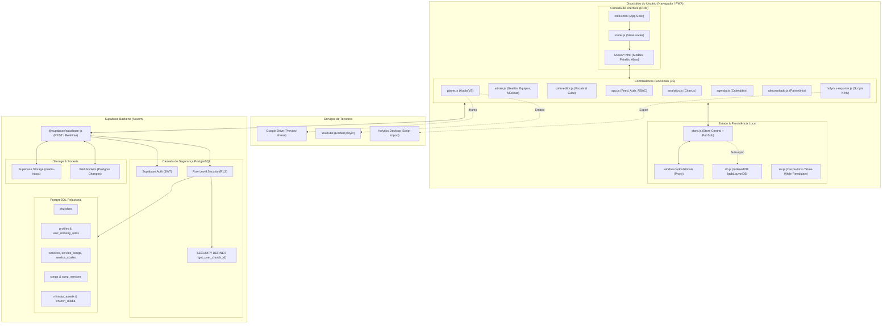

# 🏛️ Relatório de Análise Estrutural e Auditoria de Arquitetura
**Projeto:** Liturge — Gestão de Louvor, Cultos e Ministérios (`LouvorIDB / Repositorio_Igreja`)  
**Data da Auditoria:** 03 de Setembro de 2026  
**Auditor:** Arquiteto de Software Sênior & Especialista em Auditoria de Código  
**Escopo:** Análise estrutural minuciosa de código-fonte, banco de dados, segurança, performance e prontidão para SaaS Multi-tenant.

---

## Sumário Executivo

O sistema **Liturge** (anteriormente LouvorIDB) passou por uma evolução notável: transitou com sucesso de um protótipo baseado em planilhas do Google Sheets para uma aplicação web moderna (PWA) alimentada por um banco de dados relacional PostgreSQL no **Supabase**. O sistema resolve com maestria as dores operacionais de um ministério de louvor (escalas, repertório transponível, visualização de cifras, links de estudo e integração de playlists com o software Holyrics).

Entretanto, sob a ótica de engenharia de software e comercialização (SaaS Multi-igreja), o projeto encontra-se em um momento crítico de **bifurcação arquitetural**:
1. **Segurança de Dados Crítica:** Foram identificadas brechas gravíssimas nas políticas de Row Level Security (RLS) do Supabase (com permissões `USING (true)` para deleção de igrejas, perfis e papéis), além de uma função com privilégios de `SECURITY DEFINER` concedida para usuários anônimos que permite a destruição irreversível de qualquer congregação cadastrada.
2. **Monólitos de Código no Frontend:** Apesar da existência de módulos utilitários, mais de **66% de todo o JavaScript da aplicação** reside em apenas dois arquivos procedurais: [admin.js](file:///c:/Users/Jã1/Documents/GitHub/Repositorio_Igreja/public/js/admin.js) (4.176 linhas) e [app.js](file:///c:/Users/Jã1/Documents/GitHub/Repositorio_Igreja/public/js/app.js) (2.305 linhas).
3. **Engessamento de Infraestrutura Frontend:** O uso de **Tailwind via CDN de desenvolvimento em tempo real** e o *monkey-patching* global no prototype nativo do navegador (`Element.prototype.innerHTML`) cobram um preço alto em consumo de CPU e bateria em dispositivos móveis e máquinas com arquitetura ARM64.
4. **Dessincronização Offline:** O Service Worker ([sw.js](file:///c:/Users/Jã1/Documents/GitHub/Repositorio_Igreja/public/sw.js)) possui listas de cache estático desatualizadas, deixando de fora os novos módulos de Agenda, Almoxarifado, Analytics e Holyrics.

Abaixo, apresenta-se a auditoria detalhada estruturada nos 6 pilares solicitados.

---

## 1. Visão Geral & Mapeamento de Arquitetura

### 1.1. Propósito do Sistema e Stack Tecnológica

O **Liturge** é uma plataforma concebida para centralizar a gestão eclesiástica, integrando a equipe pastoral, líderes de ministérios (Louvor, Som/Técnica, Mídia, Recepção, Infantil) e voluntários. Seus módulos cobrem:
* **Escalas e Cultos:** Planejamento de cultos, atribuição de instrumentistas e vocais, aviso de conflitos e histórico de eventos.
* **Repertório e Cifras:** Acervo musical com versionamento de tons por cantor, transposição harmônica dinâmica, links de referência (YouTube) e faixas de estudo/áudio (VS via Google Drive ou Supabase Storage).
* **Almoxarifado & Wiki:** Catalogação de patrimônio técnico (cabos, instrumentos, microfones) e base de conhecimento/manuais operacionais.
* **Agenda Integrada:** Calendário de cultos recorrentes e eventos pontuais.
* **Automação de Culto:** Exportação direta de scripts compatíveis com o software de projeção **Holyrics** (`h.hly`).

| Camada | Tecnologia Adotada | Finalidade no Projeto | Diagnóstico Arquitetural |
| :--- | :--- | :--- | :--- |
| **Frontend Shell** | HTML5 Semântico, Vanilla JS | PWA leve servido estaticamente | Casca mínima funcional com injeção dinâmica de templates. |
| **Estilização** | Tailwind CSS (Play CDN) + [style.css](file:///c:/Users/Jã1/Documents/GitHub/Repositorio_Igreja/public/css/style.css) | Design system responsivo e temas customizáveis | **Inadequado para Produção:** CDN compila CSS em tempo real no cliente. |
| **Carregador de Views** | [router.js](file:///c:/Users/Jã1/Documents/GitHub/Repositorio_Igreja/public/js/router.js) (`ViewLoader`) | Injeção assíncrona de arquivos `.html` da pasta `/views` | Funciona como partial-view loader, mas carrega tudo em lote na inicialização. |
| **Gerência de Estado** | [store.js](file:///c:/Users/Jã1/Documents/GitHub/Repositorio_Igreja/public/js/store.js) | Store com PubSub e proxies em `window` | Boa iniciativa, mas violado por acessos diretos a globais. |
| **Persistência Local** | [db.js](file:///c:/Users/Jã1/Documents/GitHub/Repositorio_Igreja/public/js/db.js) (IndexedDB) + `localStorage` | Cache offline e fila de solicitações | Banco `IgdbLouvorDB` bem configurado, mas com cobertura parcial. |
| **Backend & DB** | Supabase (PostgreSQL 15+) | Autenticação, banco relacional, RLS e Storage | Estrutura relacional sólida; RLS com falhas severas de autorização. |
| **Comunicação Tempo Real** | Supabase Realtime (WebSockets) | Notificações de edição concorrente e toasts | Configurado para tabelas centrais; falta concorrência otimista. |
| **Tooling & Dev** | Vite 5.4.0 (`vite.config.js`) | Servidor local de desenvolvimento | Subutilizado: não gera bundle em produção; scripts carregados via `<script>` clássico. |

---

### 1.2. Mapeamento da Árvore de Diretórios e Responsabilidades

```text
Repositorio_Igreja/
├── .gitignore                           # Exclusões do Git (INCOMPLETO: vaza backups e CSVs)
├── package.json & vite.config.js        # Configuração do Vite e dependências
├── index.html                           # App Shell PWA e declaração sequencial de scripts
├── export_supabase.js                   # Script Node.js de exportação para backup local
├── backup_export/                       # DADOS REAIS EXPOSTOS: Backups em JSON/CSV
├── Import_Supabase/                     # DADOS REAIS EXPOSTOS: Snapshots da migração
├── LISTA TESTE.hpls                     # Arquivo binário Holyrics de 37 MB (incha o Git)
├── docs/                                # Documentação e Relatórios
│   └── auditoria/                       # Pasta dedicada da auditoria estrutural
│       └── relatorio_analise_arquitetura.md # Este relatório completo
├── public/
│   ├── manifest.json & sw.js            # Configurações PWA e Service Worker
│   ├── icon-192.png & icon-512.png      # Ícones PWA
│   ├── css/
│   │   └── style.css                    # Estilos complementares e wrappers de player
│   ├── views/                           # Partial Views HTML (Injetadas pelo ViewLoader)
│   │   ├── admin-panel.html             # Painel Administrativo multi-aba (363 linhas)
│   │   ├── modais.html                  # MONÓLITO HTML: Mais de 12 modais (1.344 linhas)
│   │   ├── secao-cultos.html            # Container de cultos
│   │   ├── secao-repertorio.html        # Filtros e listagem do acervo
│   │   ├── secao-novas.html             # Músicas em aprendizado
│   │   ├── secao-midia.html             # Central de arquivos
│   │   ├── secao-agenda.html            # Calendário de cultos
│   │   ├── secao-almoxarifado.html      # Patrimônio e Wiki
│   │   ├── secao-analytics.html         # Dashboard com Chart.js
│   │   └── secao-holyrics.html          # Configurador de seções Holyrics
│   └── js/                              # Lógica da Aplicação (9.760 linhas totais)
│       ├── config.js                    # Inicialização do Supabase Client
│       ├── store.js                     # State Manager com getters/setters e PubSub
│       ├── db.js                        # Gerenciador IndexedDB (IgdbLouvorDB)
│       ├── router.js                    # Loader dinâmico de visões HTML
│       ├── utils.js                     # Toasts, filtros e Monkey-patch do innerHTML
│       ├── player.js                    # Reprodutor de áudio (Google Drive, YouTube, Áudio nativo)
│       ├── admin.js                     # MONÓLITO GIGANTE: Toda a administração (4.176 linhas)
│       ├── app.js                       # MONÓLITO PÚBLICO: Renderização e auth (2.305 linhas)
│       ├── culto-editor.js              # Editor de cultos, accordions e escalas (850 linhas)
│       ├── holyrics-exporter.js         # Gerador de script h.hly e configurador (709 linhas)
│       ├── agenda.js                    # Lógica de calendário e regras recorrentes (984 linhas)
│       ├── almoxarifado.js              # Gestão de patrimônio e wiki (427 linhas)
│       └── analytics.js                 # Métricas e gráficos Chart.js (294 linhas)
├── sql/                                 # 11 Scripts SQL de migração e patches RLS
├── supabase_rls_multi_tenant.sql        # Script mestre de RLS (contém políticas permissivas)
└── supabase_setup_rbac_superadmin.sql   # Script de setup de Super Admin
```

---

### 1.3. Diagrama Mermaid: Arquitetura Geral & Fluxo de Dados



---

## 2. Qualidade e Padrões de Código

### 2.1. Modularidade, Legibilidade e Princípio DRY

* **Violação do Princípio de Responsabilidade Única (SRP):**  
  A maioria dos arquivos mistura até quatro responsabilidades distintas:
  1. Chamadas de rede e SQL declarativo do Supabase.
  2. Lógica de negócio e regras de validação.
  3. Manipulação direta do DOM via `document.getElementById` e classes CSS.
  4. Interpolação e renderização de blocos inteiros de HTML.
* **Duplicação de Código (Violação do DRY):**
  * A função `obterIdsMinisteriosDoUsuario(user)` foi implementada de forma idêntica em dois arquivos separados: [utils.js:L93](file:///c:/Users/Jã1/Documents/GitHub/Repositorio_Igreja/public/js/utils.js#L93) e [almoxarifado.js:L2](file:///c:/Users/Jã1/Documents/GitHub/Repositorio_Igreja/public/js/almoxarifado.js#L2).
  * O algoritmo de normalização de strings e remoção de acentos (`normalize("NFD").replace(...)`) repete-se em [utils.js:L90](file:///c:/Users/Jã1/Documents/GitHub/Repositorio_Igreja/public/js/utils.js#L90), [admin.js:L640](file:///c:/Users/Jã1/Documents/GitHub/Repositorio_Igreja/public/js/admin.js#L640) e [holyrics-exporter.js:L230](file:///c:/Users/Jã1/Documents/GitHub/Repositorio_Igreja/public/js/holyrics-exporter.js#L230).
  * A geração de cards de exibição de culto e lista de músicas tem templates duplicados entre o feed de cultos em [app.js:L2480-L2565](file:///c:/Users/Jã1/Documents/GitHub/Repositorio_Igreja/public/js/app.js#L2480-L2565) e a visualização no editor em [culto-editor.js](file:///c:/Users/Jã1/Documents/GitHub/Repositorio_Igreja/public/js/culto-editor.js).

### 2.2. Nível de Acoplamento entre Componentes

* **Acoplamento por Estado Global:**  
  Embora o [store.js](file:///c:/Users/Jã1/Documents/GitHub/Repositorio_Igreja/public/js/store.js) implemente o padrão PubSub, ele expôs acessores via `Object.defineProperty(window, ...)` para manter variáveis globais como `window.dadosGlobais`, `window.usuarioLogado` e `window.isAdmin`. Como consequência, quase todos os módulos continuam lendo e mutando essas variáveis globais sem notificar o Store, gerando estados fantasmas.
* **Acoplamento Temporal de Scripts:**  
  Os scripts em [index.html:L396-L409](file:///c:/Users/Jã1/Documents/GitHub/Repositorio_Igreja/index.html#L396-L409) dependem de uma ordem estrita de carregamento no navegador (`config.js` -> `store.js` -> `db.js` -> `router.js` -> `utils.js` -> ... -> `app.js`). Se qualquer arquivo falhar ao carregar ou for reordenado, variáveis globais essenciais tornam-se `undefined`, quebrando a aplicação em cascata.

### 2.3. Identificação de Arquivos Monolíticos e Complexidade

* **[admin.js](file:///c:/Users/Jã1/Documents/GitHub/Repositorio_Igreja/public/js/admin.js):** 4.176 linhas (228 KB). Reúne autenticação, upload de mídias, importador Holyrics, scraper/parser do Cifra Club, gerenciador de ministérios, editor de cifras, editor de letras e controle de cotas de igrejas.
* **[app.js](file:///c:/Users/Jã1/Documents/GitHub/Repositorio_Igreja/public/js/app.js):** 2.305 linhas (126 KB). Contém renderização do feed, controle de permissões (RBAC), cadastro de igrejas (onboarding SaaS), listeners em tempo real e migração em memória de notas legadas.
* **[modais.html](file:///c:/Users/Jã1/Documents/GitHub/Repositorio_Igreja/public/views/modais.html):** 1.344 linhas (106 KB). Agrupa mais de 12 modais em um único arquivo HTML que é injetado integralmente no DOM na inicialização, consumindo memória sem necessidade.
* **Funções Excessivamente Extensas:**
  * `salvarCulto()` em [culto-editor.js:L689-L880](file:///c:/Users/Jã1/Documents/GitHub/Repositorio_Igreja/public/js/culto-editor.js#L689-L880): ~200 linhas com alta complexidade ciclomática, múltiplos `for` loops aninhados e N+1 queries síncronas.
  * `confirmarImportacaoHolyrics()` em [admin.js](file:///c:/Users/Jã1/Documents/GitHub/Repositorio_Igreja/public/js/admin.js): ~180 linhas processando JSON complexo e inserindo registros em loops sem lote (*batch*).

---

## 3. Fluxo de Dados e Integrações

### 3.1. Gerenciamento de Estado

Existe uma convivência conflituosa entre três fontes de verdade:
1. **Memória do Navegador:** `_state` dentro do [store.js](file:///c:/Users/Jã1/Documents/GitHub/Repositorio_Igreja/public/js/store.js) refletido em `window.dadosGlobais`.
2. **Armazenamento no IndexedDB:** Gerenciado por [db.js](file:///c:/Users/Jã1/Documents/GitHub/Repositorio_Igreja/public/js/db.js) com as tabelas `repertorio`, `novas`, `cultos`, `solicitacoes_offline`.
3. **Armazenamento no `localStorage`:** Utilizado separadamente para cores de tema e templates de seção do Holyrics (`holyrics_template_${churchId}`).

*Risco Lógico:* Caso um administrador edite uma música diretamente no Supabase em uma aba e o evento Realtime não atualize o IndexedDB, a leitura offline posterior retornará dados defasados (*Stale Data*).

### 3.2. Conexões com Serviços Externos

* **Supabase Client (`@supabase/supabase-js`):**
  * Chamadas REST declarativas bem formatadas.
  * Realtime: Assinaturas de canal ativas em [app.js:L10-L40](file:///c:/Users/Jã1/Documents/GitHub/Repositorio_Igreja/public/js/app.js#L10-L40) para `services`, `availability_comments`, `songs` e `song_versions`.
* **Google Drive (Embed via iframe):**
  * Utilizado em [player.js:L53-L60](file:///c:/Users/Jã1/Documents/GitHub/Repositorio_Igreja/public/js/player.js#L53-L60) (`https://drive.google.com/file/d/{id}/preview`).
  * **Problema:** O Google Drive impõe restrições severas de taxa (HTTP 403 / 429) e bloqueio de cookies de terceiros no Safari (iOS / iPadOS), causando falhas frequentes na reprodução de VS.
* **YouTube Embed:**
  * Implementado em [player.js:L79-L86](file:///c:/Users/Jã1/Documents/GitHub/Repositorio_Igreja/public/js/player.js#L79-L86). Funciona bem, mas precisa de tratamento para URLs encurtadas (`youtu.be`) e parâmetros de playlist.
* **Holyrics Desktop Integration:**
  * O [holyrics-exporter.js](file:///c:/Users/Jã1/Documents/GitHub/Repositorio_Igreja/public/js/holyrics-exporter.js) gera scripts JavaScript nativos (`h.hly`) contendo o payload da playlist. Excelente solução arquitetural sem dependência de servidores intermediários.

### 3.3. Tratamento de Exceções, Resiliência e Concorrência

1. **Ausência de Transações Atômicas (Falhas de Rede Incompletas):**  
   Ao salvar um culto em [culto-editor.js:L789-L865](file:///c:/Users/Jã1/Documents/GitHub/Repositorio_Igreja/public/js/culto-editor.js#L789-L865), o sistema executa:
   ```javascript
   await supabaseClient.from('service_songs').delete().eq('service_id', serviceId);
   await supabaseClient.from('service_scales').delete().eq('service_id', serviceId);
   // ... depois insere as novas músicas e instrumentistas
   await supabaseClient.from('service_scales').insert(scalesToInsert);
   ```
   **O "Porquê" do Perigo:** No Supabase REST, cada chamada `.delete()` ou `.insert()` é uma transação HTTP independente. Se a conexão falhar ou o usuário fechar a aba exatamente após o `delete`, o culto fica permanentemente esvaziado de músicas e escalas no banco de dados.  
   *Solução Necessária:* Encapsular o salvamento em uma Stored Procedure (função RPC no PostgreSQL) para garantir que todas as inserções ocorram sob uma única transação atômica (`BEGIN ... COMMIT`).

2. **Problema N+1 em Queries Assíncronas:**  
   No loop de músicas de [culto-editor.js:L867-L880](file:///c:/Users/Jã1/Documents/GitHub/Repositorio_Igreja/public/js/culto-editor.js#L867-L880), para cada música que não tenha `song_version_id`, o sistema executa uma consulta individual ao Supabase:
   ```javascript
   for (let idx = 0; idx < musicasCultoAtual.length; idx++) {
       const { data: sData } = await supabaseClient.from('songs').select(...).eq('title', m.nome).maybeSingle();
   }
   ```
   Para um culto com 10 músicas, isso dispara 10 requisições HTTP em série, atrasando o salvamento em vários segundos em redes móveis.

3. **Inexistência de Concorrência Otimista (*Lost Updates*):**  
   Se dois líderes abrirem a edição do mesmo culto simultaneamente, o último a clicar em "Salvar Culto" sobrescreverá cegamente as alterações do primeiro, sem aviso prévio de conflito de versão.

---

## 4. Segurança, Permissões e Boas Práticas

### 4.1. Brechas Críticas no Row Level Security (RLS) do Supabase

Esta é a área mais alarmante identificada na auditoria. Diversas políticas foram relaxadas através de scripts corretivos com `USING (true)`, desativando completamente a barreira de segurança do banco:

#### 🚨 VULNERABILIDADE 1: Destruição Anônima em Cascata de Igrejas (Gravidade: Crítica / CVSS 10.0)
* **Arquivo:** [sql/delete_church_cascade.sql:L8-L10](file:///c:/Users/Jã1/Documents/GitHub/Repositorio_Igreja/sql/delete_church_cascade.sql#L8-L10) e [L65](file:///c:/Users/Jã1/Documents/GitHub/Repositorio_Igreja/sql/delete_church_cascade.sql#L65)
* **Código Vulnerável:**
  ```sql
  CREATE POLICY "Permitir exclusão de igrejas por admins" ON churches
      FOR DELETE USING (true);

  GRANT EXECUTE ON FUNCTION delete_church_cascade(UUID) TO authenticated, anon, service_role;
  ```
* **O Risco Lógico:** A função `delete_church_cascade` foi criada com `SECURITY DEFINER` (executa com privilégios de superusuário do banco) e concedida para a role `anon`. Qualquer indivíduo na internet que inspecione o código-fonte, copie a chave anônima pública e dispare no console do navegador:
  `await supabaseClient.rpc('delete_church_cascade', { target_church_id: 'ID_DA_IGREJA' });`
  conseguirá **apagar permanentemente** a igreja, todos os seus cultos, músicas, arquivos, escalas e desvincular todos os usuários, sem precisar estar autenticado!

#### 🚨 VULNERABILIDADE 2: Exclusão Total de Perfis de Usuários (Gravidade: Crítica)
* **Arquivo:** [sql/fix_delete_policies.sql:L14-L17](file:///c:/Users/Jã1/Documents/GitHub/Repositorio_Igreja/sql/fix_delete_policies.sql#L14-L17)
* **Código Vulnerável:**
  ```sql
  CREATE POLICY "Permitir exclusão de perfis por admins" ON profiles
      FOR DELETE USING (true);
  ```
* **O Risco Lógico:** `USING (true)` sem checagem de `auth.uid()` ou perfil administrativo permite que qualquer usuário anônimo ou comum execute:
  `await supabaseClient.from('profiles').delete().neq('id', '00000000-0000-0000-0000-000000000000');`
  e delete todos os membros cadastrados na congregação.

#### 🚨 VULNERABILIDADE 3: Modificação Irrestrita de Funções e Papéis Ministeriais (Gravidade: Alta)
* **Arquivo:** [sql/fix_ministry_roles_rls.sql:L11-L26](file:///c:/Users/Jã1/Documents/GitHub/Repositorio_Igreja/sql/fix_ministry_roles_rls.sql#L11-L26)
* **Código Vulnerável:**
  ```sql
  CREATE POLICY "Permitir tudo em user_ministry_roles" ON user_ministry_roles FOR ALL USING (true) WITH CHECK (true);
  CREATE POLICY "Permitir tudo em ministry_roles" ON ministry_roles FOR ALL USING (true) WITH CHECK (true);
  CREATE POLICY "Permitir tudo em ministry_leaders" ON ministry_leaders FOR ALL USING (true) WITH CHECK (true);
  ```
* **O Risco Lógico:** Permite que qualquer usuário altere os líderes de ministérios (`ministry_leaders`) e promova seu próprio perfil a líder ou administrador.

#### 🚨 VULNERABILIDADE 4: Autorização Exclusivamente no Client-Side (Gravidade: Alta)
* Em [supabase_rls_multi_tenant.sql:L79-L88](file:///c:/Users/Jã1/Documents/GitHub/Repositorio_Igreja/supabase_rls_multi_tenant.sql#L79-L88), a tabela `services` possui a política:
  ```sql
  CREATE POLICY "Cultos filtrados por igreja" ON services
      FOR ALL USING (church_id IS NULL OR church_id = get_user_church_id());
  ```
* **O Risco Lógico:** A política cobre `FOR ALL` (SELECT, INSERT, UPDATE, DELETE). Como ela checa apenas se o `church_id` pertence à igreja do usuário, **qualquer voluntário autenticado (mesmo com papel de visitante ou membro)** possui permissão a nível de banco para deletar cultos via API REST do Supabase. A restrição de botões só existe no JavaScript do navegador (`hasPermission`).

---

### 4.2. Credenciais Hardcoded e Dados Pessoais Expostos

1. **E-mail de Desenvolvedor Hardcoded no Código de Produção:**  
   Em [public/js/admin.js:L3](file:///c:/Users/Jã1/Documents/GitHub/Repositorio_Igreja/public/js/admin.js#L3) e [supabase_setup_rbac_superadmin.sql:L54](file:///c:/Users/Jã1/Documents/GitHub/Repositorio_Igreja/supabase_setup_rbac_superadmin.sql#L54):
   ```javascript
   const ADMIN_EMAIL = "joao.marcos.xavier.484@gmail.com";
   ```
   **O "Porquê" do Erro:** O atalho de login admin (`Ctrl+Shift+A` ou 5 toques no título) tenta autenticar diretamente contra essa conta específica usando a senha digitada. Em um SaaS Multi-tenant, cada igreja possui seus próprios administradores. Isso amarra todas as instâncias a uma única conta e expõe publicamente o e-mail pessoal no repositório.
2. **Chave Anônima do Supabase (`SUPABASE_ANON_KEY`):**  
   Presente em [public/js/config.js:L2](file:///c:/Users/Jã1/Documents/GitHub/Repositorio_Igreja/public/js/config.js#L2) e [export_supabase.js:L7](file:///c:/Users/Jã1/Documents/GitHub/Repositorio_Igreja/export_supabase.js#L7). A exposição da chave anônima é aceitável em arquiteturas Supabase *somente se o RLS estiver 100% blindado*. Como há políticas `USING (true)`, a chave torna-se uma credencial de escrita e deleção irrestrita.
3. **Vazamento de Backups no Git:**  
   As pastas `backup_export/` e `Import_Supabase/` contêm arquivos CSV e JSON com dados reais de usuários, congregações e histórico de cultos, e **não estão no `.gitignore`**.

---

### 4.3. Sanitização de Entradas e Injeção XSS

* **O Anti-Pattern do Monkey-Patch de `innerHTML`:**  
  Em [public/js/utils.js:L2-L20](file:///c:/Users/Jã1/Documents/GitHub/Repositorio_Igreja/public/js/utils.js#L2-L20), o projeto intercepta o setter nativo `Element.prototype.innerHTML` para passar o conteúdo pelo `DOMPurify.sanitize()`.
  * **Problema de Segurança:** O código declara:
    ```javascript
    ADD_ATTR: ['onclick', 'onsubmit', 'onchange', 'oninput', ...],
    ADD_TAGS: ['iframe', 'svg', ...]
    ```
    Permitir atributos como `onclick` anula o objetivo primordial do DOMPurify, pois atributos inline são o vetor número um de execução de código em ataques XSS.
  * **Problema de Performance:** Cada manipulação de DOM no navegador agora força a serialização e execução do parser HTML do DOMPurify, consumindo ciclos desnecessários de CPU.
* **Interpolação Frágil de Strings em Atributos HTML:**  
  Em [public/js/app.js:L2533-L2539](file:///c:/Users/Jã1/Documents/GitHub/Repositorio_Igreja/public/js/app.js#L2533-L2539):
  ```javascript
  onclick="abrirModalLetraPublica('${nomeMusica.replace(/'/g, "\\'")}', ...)"
  ```
  Se o título da música contiver aspas duplas (`"`), quebras de linha ou caracteres de fechamento de tag, o atributo `onclick` quebra a sintaxe HTML ou permite que scripts sejam injetados.

---

## 5. Performance, Compatibilidade e Responsividade

### 5.1. Tempo de Carregamento, Empacotamento e Renderização

1. **Uso do Tailwind Play CDN em Produção:**  
   Em [index.html:L18](file:///c:/Users/Jã1/Documents/GitHub/Repositorio_Igreja/index.html#L18):
   ```html
   <script src="https://cdn.tailwindcss.com"></script>
   ```
   **O "Porquê" da Ineficiência:** O próprio time do Tailwind adverte categoricamente que o script Play CDN é exclusivo para desenvolvimento e prototipação. Ele carrega um bundle de mais de 3 MB (não comprimido) e executa um MutationObserver contínuo para compilar estilos CSS em tempo de execução dentro do navegador do usuário. Em conexões 3G/4G e dispositivos móveis, isso causa bloqueio da thread principal, FOUC (*Flash of Unstyled Content*) e atraso severo no LCP (*Largest Contentful Paint*).
2. **Ausência de Bundling Moderno:**  
   O projeto possui Vite no [package.json](file:///c:/Users/Jã1/Documents/GitHub/Repositorio_Igreja/package.json), mas os scripts em [index.html](file:///c:/Users/Jã1/Documents/GitHub/Repositorio_Igreja/index.html) são carregados via 14 requisições `<script src="...">` separadas sem `type="module"`, impedindo minificação, tree-shaking e compressão Gzip/Brotli otimizada.
3. **Carga em Lote das Visões HTML:**  
   O [router.js:L83](file:///c:/Users/Jã1/Documents/GitHub/Repositorio_Igreja/public/js/router.js#L83) carrega todas as 10 visões HTML simultaneamente (`Promise.all`) logo no `DOMContentLoaded`, incluindo o painel admin e modais analíticos que o usuário talvez nem venha a abrir na sessão.

### 5.2. Service Worker e Integridade Offline (PWA)

* **Cache Estático Desatualizado em [sw.js:L3-L26](file:///c:/Users/Jã1/Documents/GitHub/Repositorio_Igreja/public/sw.js#L3-L26):**  
  A constante `ASSETS_TO_CACHE` **não contém** os seguintes arquivos essenciais adicionados recentemente:
  * `./js/almoxarifado.js`
  * `./js/analytics.js`
  * `./js/agenda.js`
  * `./views/secao-agenda.html`
  * `./views/secao-almoxarifado.html`
  * `./views/secao-analytics.html`
  * `./views/secao-holyrics.html`
  * **Consequência:** Se o voluntário abrir o PWA sem internet durante um ensaio, ao navegar para a Agenda, Almoxarifado ou Holyrics, a tela ficará completamente em branco.
* **Ícone Faltante:** O [manifest.json:L11](file:///c:/Users/Jã1/Documents/GitHub/Repositorio_Igreja/public/manifest.json#L11) referencia `favicon.ico`, mas o arquivo físico não existe na pasta `public/`.

### 5.3. Compatibilidade com Ambientes ARM64 e Dispositivos Móveis

* **Ambiente de Desenvolvimento ARM64 (Samsung Galaxy Book4 Edge / Snapdragon X Plus):**
  * O processador Snapdragon X Plus possui alta eficiência térmica e instruções ARM64 nativas. Contudo, o overhead de interpretar 3MB de Tailwind CDN no navegador + DOMPurify em cada nó HTML desperdiça energia da bateria e gera micro-travamentos desnecessários.
  * A migração para compilação local (build Vite) tornará o carregamento instantâneo.
* **Dispositivo de Referência Mobile (Samsung Galaxy S24 - 1080x2340):**
  * A tela do celular comporta bem a navegação pelas abas inferiores, mas modais como o de edição de culto ([modais.html](file:///c:/Users/Jã1/Documents/GitHub/Repositorio_Igreja/public/views/modais.html)) contêm seletores dinâmicos e tabelas com elementos que ultrapassam a viewport horizontal, gerando scroll lateral indesejado.
  * O rodapé de áudio fixo ([player.js](file:///c:/Users/Jã1/Documents/GitHub/Repositorio_Igreja/public/js/player.js)) sobrepõe os botões inferiores de confirmação em telas com altura inferior a 700px.

---

## 6. Diagnóstico de Dívida Técnica e Próximos Passos

### 6.1. Matriz de Prioridades

| ID | Classificação | Item / Ponto Crítico | Impacto / Risco | Complexidade de Correção |
| :---: | :---: | :--- | :--- | :---: |
| **P1** | 🔴 **Alta (Crítica)** | Revogação de `delete_church_cascade` para `anon` e correção de políticas `USING (true)` em `churches`, `profiles`, `ministry_roles` e `user_ministry_roles`. | **Catastrófico:** Qualquer visitante pode apagar congregações inteiras ou alterar permissões. | Baixa (Apenas SQL) |
| **P2** | 🔴 **Alta (Crítica)** | Implementação de validação de papéis (`system_role = 'admin'`) a nível de banco nas políticas de UPDATE e DELETE de `services` e `songs`. | **Grave:** Voluntários comuns podem deletar cultos de outros membros via console F12. | Média (SQL) |
| **P3** | 🔴 **Alta (Crítica)** | Remoção do `ADMIN_EMAIL` hardcoded em [admin.js](file:///c:/Users/Jã1/Documents/GitHub/Repositorio_Igreja/public/js/admin.js) e transição do atalho de admin para autenticação multi-tenant legítima. | **Alto:** Violação de isolamento multi-tenant e exposição de dado pessoal. | Baixa |
| **P4** | 🔴 **Alta (Crítica)** | Adicionar os 7 arquivos e visões faltantes no `ASSETS_TO_CACHE` do [sw.js](file:///c:/Users/Jã1/Documents/GitHub/Repositorio_Igreja/public/sw.js) e corrigir `.gitignore`. | **Alto:** Quebra total de funcionamento offline na Agenda e Almoxarifado. | Muito Baixa |
| **P5** | 🟡 **Média** | Substituição do Tailwind Play CDN por processo de build Vite com Tailwind CLI / PostCSS. | **Médio:** Redução de ~3MB de bundle para ~25KB de CSS puro; eliminação de atraso de renderização. | Média |
| **P6** | 🟡 **Média** | Criação de RPC Postgres para salvar culto, escalas e músicas em uma única transação atômica. | **Médio:** Previne perda irrecuperável de repertório em quedas de sinal durante a edição. | Média |
| **P7** | 🟡 **Média** | Remoção do monkey-patch de `innerHTML` em [utils.js](file:///c:/Users/Jã1/Documents/GitHub/Repositorio_Igreja/public/js/utils.js) e adoção de sanitização explícita nos pontos de injeção. | **Médio:** Corrige falsa sensação de segurança XSS e otimiza a thread do browser. | Média |
| **P8** | 🟢 **Baixa** | Decomposição dos monólitos [admin.js](file:///c:/Users/Jã1/Documents/GitHub/Repositorio_Igreja/public/js/admin.js) e [app.js](file:///c:/Users/Jã1/Documents/GitHub/Repositorio_Igreja/public/js/app.js) em módulos ES especializados. | **Baixo (Manutenibilidade):** Facilita testes, colaboração e futura transição para React Native. | Alta |
| **P9** | 🟢 **Baixa** | Carregamento sob demanda (*lazy-loading*) dos templates de modais em [router.js](file:///c:/Users/Jã1/Documents/GitHub/Repositorio_Igreja/public/js/router.js). | **Baixo:** Melhora o consumo inicial de memória no mobile. | Baixa |

---

### 6.2. Plano de Ação Passo a Passo (Roadmap de Execução Recomendado)

Para manter a estabilidade do sistema e respeitar o princípio de passos atômicos incrementais, recomenda-se a seguinte ordem de execução:

#### Etapa 1: Blindagem Imediata do Banco de Dados (SQL no Supabase)
1. **Revogar Execução Anônima:**
   ```sql
   REVOKE EXECUTE ON FUNCTION delete_church_cascade(UUID) FROM anon;
   REVOKE EXECUTE ON FUNCTION delete_church_cascade(UUID) FROM public;
   GRANT EXECUTE ON FUNCTION delete_church_cascade(UUID) TO authenticated;
   ```
2. **Reescrever `delete_church_cascade`:** Exigir validação de que `auth.uid()` pertence a `public.super_admins` antes de executar qualquer deleção.
3. **Substituir Políticas `USING (true)`:**
   * Em `churches`: Permitir DELETE e UPDATE apenas para Super Admins ou para o pastor administrador cujo `profiles.church_id = churches.id AND profiles.system_role = 'admin'`.
   * Em `profiles`: Permitir DELETE apenas se `system_role = 'admin'`.
   * Em `services`: Permitir INSERT/UPDATE/DELETE apenas para usuários autenticados com `system_role IN ('admin', 'lider')`.

#### Etapa 2: Saneamento do Repositório e PWA Offline
1. **Atualizar o [sw.js](file:///c:/Users/Jã1/Documents/GitHub/Repositorio_Igreja/public/sw.js):** Incluir `almoxarifado.js`, `analytics.js`, `agenda.js` e as visões faltantes no cache do Service Worker, incrementando o nome do cache para `liturge-v2`.
2. **Blindar o [.gitignore](file:///c:/Users/Jã1/Documents/GitHub/Repositorio_Igreja/.gitignore):** Adicionar `backup_export/`, `Import_Supabase/`, `dist/` e `*.hpls` para não versionar dados privados ou binários pesados.
3. **Limpar E-mail Pessoal em [admin.js](file:///c:/Users/Jã1/Documents/GitHub/Repositorio_Igreja/public/js/admin.js):** Modificar a autenticação de atalho para solicitar login regular via Supabase Auth ou consultar o papel do usuário já logado.

#### Etapa 3: Performance e Otimização do Frontend
1. **Compilar o Tailwind CSS Nativo no Vite:**
   * Instalar `tailwindcss` e `postcss` como dependências de desenvolvimento.
   * Criar o arquivo `tailwind.config.js` e compilar o CSS no arquivo final de saída, removendo `<script src="https://cdn.tailwindcss.com"></script>` do [index.html](file:///c:/Users/Jã1/Documents/GitHub/Repositorio_Igreja/index.html).
2. **Transação Atômica no Salvamento de Cultos:**
   * Criar a Stored Procedure `salvar_culto_completo(dados_json)` no Supabase para executar update/insert de cultos, escalas e músicas em bloco único protegido.
3. **Substituir Monkey-Patch de `innerHTML`:**
   * Remover a redefinição global do `Element.prototype.innerHTML` e aplicar `DOMPurify.sanitize()` pontualmente nos dados provindos do banco de dados antes da renderização.

---
*Relatório concluído e arquivado na pasta dedicada de auditoria.*  
*Arquivo gerado:* `docs/auditoria/relatorio_analise_arquitetura.md`
