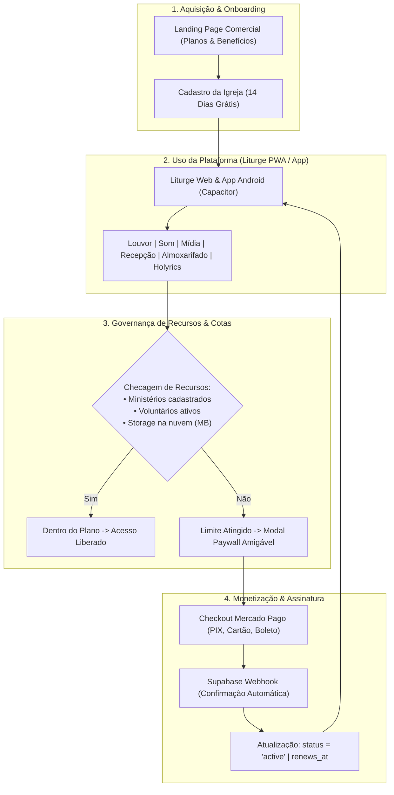
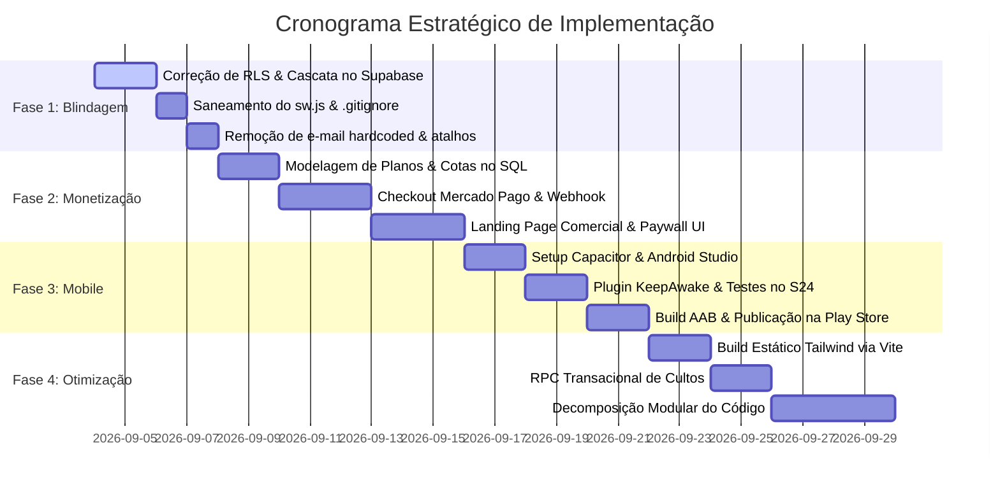

# 🎯 Master Plan: Transformação do Liturge em SaaS Lucrativo e Aplicativo Mobile

Este documento estabelece o **Plano Diretor Estrutural e Comercial** do sistema **Liturge (`LouvorIDB / Repositorio_Igreja`)**. Ele foi formulado com base na auditoria estrutural e nas decisões alinhadas durante a entrevista investigativa (`/grill-me`).

O plano organiza todas as ações técnicas e de negócios em **três eixos funcionais** (O que Corrigir, O que Implementar e O que Remover) e divide a execução em **4 Fases Sequenciais**, garantindo que o sistema continue 100% operacional durante todo o processo.

---

## 1. Visão Geral & Raciocínio Lógico

### O Problema a Resolver
1. **Insegurança de Dados Multi-tenant:** O banco PostgreSQL possui brechas críticas onde funções com `SECURITY DEFINER` e políticas com `USING (true)` permitem que usuários anônimos apaguem ou alterem dados de qualquer igreja.
2. **Ausência de Mecanismo de Monetização:** O sistema não possui tabelas de planos, cotas automáticas por recursos (ministérios, voluntários, armazenamento) nem checkout integrado para cobrança recorrente.
3. **Restrição Web / PWA:** O sistema ainda não está presente nas lojas oficiais de aplicativos (Google Play Store e Apple App Store), o que reduz a credibilidade comercial e dificulta a adesão de pastores e voluntários menos habituados com atalhos de navegador.
4. **Débito Técnico e Monólitos:** Arquivos com mais de 4.000 linhas ([admin.js](file:///c:/Users/Jã1/Documents/GitHub/Repositorio_Igreja/public/js/admin.js)) e compilação do Tailwind via CDN em tempo real causam lentidão e dificultam a manutenção contínua.

### A Solução Lógica (Abordagem Cirúrgica e Incremental)
Adotaremos a estratégia consagrada de engenharia de software **Strangler Fig Pattern** (Refatoração Incremental Segura):
* **Fase 1: Blindagem e Saneamento (Fundação Inquebrável):** Fechar 100% das brechas de segurança no Supabase, atualizar o Service Worker offline e proteger o repositório Git, sem alterar o comportamento visual das telas.
* **Fase 2: Motor SaaS & Monetização (Mercado Pago):** Estruturar o catálogo de planos baseado no consumo de recursos (ministérios, voluntários e armazenamento), criar landing page comercial de alta conversão e integrar checkout transparente com PIX, Cartão e Boleto.
* **Fase 3: Transformação em Aplicativo Mobile (Capacitor para Android):** Empacotar o PWA com **Capacitor** nativo, publicar o aplicativo na Google Play Store com recursos nativos (KeepAwake para palco, ícone oficial e splash screen) e estruturar a base futura para React Native (Fase Mobile 2).
* **Fase 4: Modernização de Frontend & Otimização Extrema:** Compilar Tailwind CSS estático no Vite, criar transações atômicas via RPC no Supabase e modularizar gradualmente os códigos monolíticos.

---

## 2. Diagrama Mermaid: Arquitetura de Negócio e Ciclo de Vida do SaaS

---

## 3. Os 3 Eixos de Ação Funcional

### 🔴 EIXO 1: O Que Precisa Ser CORRIGIDO (Bugs & Riscos Críticos)
1. **Brecha Crítica de Exclusão de Igrejas:**
   - Revogar permissão concedida à role `anon` na função `delete_church_cascade(UUID)` em [sql/delete_church_cascade.sql](file:///c:/Users/Jã1/Documents/GitHub/Repositorio_Igreja/sql/delete_church_cascade.sql).
   - Exigir checagem explícita de `is_super_admin()` no PostgreSQL antes de permitir qualquer exclusão em cascata.
2. **Políticas de RLS Permissivas (`USING (true)`):**
   - Substituir `USING (true)` em `profiles`, `churches`, `ministry_roles`, `user_ministry_roles`, `availability_comments` e `song_versions` por regras rígidas de tenant (`church_id = get_user_church_id()`).
   - Adicionar checagem server-side de `system_role IN ('admin', 'lider')` para comandos `INSERT`, `UPDATE` e `DELETE` em `services`, `songs` e `ministries`.
3. **PWA Offline Incompleto no [sw.js](file:///c:/Users/Jã1/Documents/GitHub/Repositorio_Igreja/public/sw.js):**
   - Incluir no `ASSETS_TO_CACHE` os 3 arquivos de script faltantes (`almoxarifado.js`, `analytics.js`, `agenda.js`) e as 4 views HTML (`secao-agenda.html`, `secao-almoxarifado.html`, `secao-analytics.html`, `secao-holyrics.html`).
   - Incrementar versão do cache para forçar a atualização imediata nos celulares dos usuários.
4. **Vazamento de Dados Pessoais e Backups no [.gitignore](file:///c:/Users/Jã1/Documents/GitHub/Repositorio_Igreja/.gitignore):**
   - Ignorar imediatamente as pastas `backup_export/`, `Import_Supabase/`, `dist/` e arquivos de mídia/listas pesadas como `*.hpls` (arquivo atual de 37MB).
5. **Transação Atômica ao Salvar Cultos ([culto-editor.js](file:///c:/Users/Jã1/Documents/GitHub/Repositorio_Igreja/public/js/culto-editor.js)):**
   - Eliminar a sequência frágil de `delete` seguido de múltiplos `insert`. Substituir por uma função RPC no PostgreSQL (`salvar_culto_transacional`) que executa tudo sob um único bloco `BEGIN ... COMMIT`.
6. **Queries N+1 no Editor de Cultos e no Analytics:**
   - No editor de cultos, recuperar os IDs das músicas em um único `SELECT ... WHERE title IN (...)` em vez de uma consulta HTTP por música em loop.
   - No [analytics.js](file:///c:/Users/Jã1/Documents/GitHub/Repositorio_Igreja/public/js/analytics.js), filtrar `service_songs` e `service_scales` por `church_id` e período de datas diretamente no SQL antes de baixar os dados para a memória.

---

### 🟢 EIXO 2: O Que Precisa Ser IMPLEMENTADO (Monetização & Escala)

#### A. Modelo de Planos por Recursos (Tiers Comerciais)
A precificação será estruturada estritamente com base nos 3 recursos alinhados na entrevista:

| Plano | Ministérios | Voluntários Ativos | Armazenamento na Nuvem | Valor Sugerido (Mensal) | Valor Sugerido (Anual - 2 meses grátis) |
| :--- | :---: | :---: | :---: | :---: | :---: |
| **Gratuito (Trial)** | 1 ministério (Louvor) | Até 10 membros | 100 MB | R$ 0 (14 a 30 dias) | — |
| **Essencial (Pequenas Igrejas)** | Até 2 ministérios | Até 20 membros | 1 GB (Áudios/Cifras) | **R$ 49,90 / mês** | **R$ 499,00 / ano** |
| **Pro (Igrejas Médias)** | Até 5 ministérios | Até 50 membros | 5 GB (Vídeos/Mídias) | **R$ 89,90 / mês** | **R$ 899,00 / ano** |
| **Premium (Igrejas Grandes)** | Ilimitados | Ilimitados | 20 GB + Suporte VIP | **R$ 149,90 / mês** | **R$ 1.499,00 / ano** |

*Recursos de Diferenciação que Alavancam Upgrades:*
* Exportação nativa e ilimitada de scripts para o **Holyrics** disponível a partir do plano Essencial.
* Dashboard de **Analytics e Inteligência de Dados** disponível a partir do plano Pro.
* Modais de aviso pedagógicos ("Você atingiu 20 membros cadastrados no plano Essencial. Deseja fazer upgrade para o Pro?").

#### B. Integração com Gateway Mercado Pago
* Implementação do **Checkout Transparente / Links de Pagamento Recorrentes** do Mercado Pago.
* Suporte nativo a **PIX** (com QR Code copia e cola instantâneo), **Cartão de Crédito** (cobrança mensal automática) e **Boleto Bancário** (essencial para tesourarias de igrejas).
* Criação de um Webhook no Supabase (Edge Function ou endpoint seguro) para receber as notificações do Mercado Pago e atualizar automaticamente o status da igreja (`status = 'active'`, `plan_id = '...'`, `subscription_renews_at = '...'`).

#### C. Landing Page Comercial de Alta Conversão
* Criação de uma página inicial atraente e responsiva apresentando:
  * Vídeo/GIF demonstrativo do gerador de escalas e cifras dinâmicas.
  * O recurso matador de exportação para o Holyrics em 1 clique.
  * Tabela comparativa de planos clara e transparente.
  * Botão de chamada para ação (CTA): *"Comece 14 Dias Grátis — Sem Cartão de Crédito"*.

#### D. Aplicativo Mobile Oficial (Android via Capacitor)
* Configuração do **Capacitor 6+** no projeto.
* Geração do projeto nativo em Android Studio (`/android`).
* Ativação do plugin `@capacitor-community/keep-awake` para impedir que a tela do celular apague durante cultos e ensaios (essencial para leitura de cifras).
* Geração do pacote compilado `.aab` (Android App Bundle) assinado para publicação na Google Play Store.

#### E. Notificações Rápidas via WhatsApp
* No card de culto, botão **"Notificar Escala via WhatsApp"**:
  * O sistema varre os voluntários escalados, identifica quem possui telefone cadastrado e gera links dinâmicos no padrão `wa.me/55...` com a mensagem pré-formatada:
    *"Olá [Nome], você foi escalado para o [Culto] no dia [Data] como [Instrumento/Função]. Confira o repertório completo aqui: [Link]"*.

---

### 🟡 EIXO 3: O Que Precisa Ser REMOVIDO (Limpeza de Débito Técnico)
1. **Remoção de E-mail Pessoal Hardcoded:**
   - Excluir `const ADMIN_EMAIL = "joao.marcos.xavier.484@gmail.com";` em [public/js/admin.js](file:///c:/Users/Jã1/Documents/GitHub/Repositorio_Igreja/public/js/admin.js#L3) e no SQL.
   - Desativar o login de atalho que usava esse e-mail. Acesso ao painel administrativo passará a exigir que o usuário logado tenha perfil de líder ou administrador em sua respectiva igreja.
2. **Remoção do Monkey-Patch de `Element.prototype.innerHTML`:**
   - Eliminar o código de interceptação em [public/js/utils.js:L2-L20](file:///c:/Users/Jã1/Documents/GitHub/Repositorio_Igreja/public/js/utils.js#L2-L20).
   - Substituir por funções utilitárias explícitas de sanitização (`DOMPurify.sanitize`) apenas nos pontos onde dados de usuários são renderizados.
3. **Remoção do Tailwind Play CDN em Produção:**
   - Remover `` do [index.html](file:///c:/Users/Jã1/Documents/GitHub/Repositorio_Igreja/index.html) após configurar a compilação local via Vite e PostCSS.
4. **Remoção de Arquivos Mortos e Dados de Teste:**
   - Desvincular e remover do repositório os arquivos temporários da migração inicial do Google Sheets (`Import_Supabase/`, `backup_export/` e `LISTA TESTE.hpls`).
   - Remover funções utilitárias duplicadas como a segunda definição de `obterIdsMinisteriosDoUsuario`.

---

## 4. Roteiro de Execução Passo a Passo (4 Fases)

### Fase 1: Blindagem de Segurança & Saneamento (Fundação)
* **Meta:** Eliminar qualquer risco de perda de dados ou acesso indevido sem alterar a experiência visual existente.
* **Ações:**
  1. Executar script SQL revogando acesso público a `delete_church_cascade` e travando exclusões de perfis e ministérios.
  2. Adicionar checagem server-side de `system_role` em `services` e `songs`.
  3. Atualizar `sw.js` com os arquivos e visões que faltavam para garantir 100% de funcionamento offline.
  4. Adicionar dados pesados e temporários no `.gitignore`.

### Fase 2: Motor SaaS, Planos & Mercado Pago (Monetização)
* **Meta:** Permitir que o sistema cobre automaticamente das congregações e controle cotas de uso.
* **Ações:**
  1. Criar tabela `plans` no Supabase e colunas de controle na tabela `churches`.
  2. Implementar função de verificação de limites (paywall) no frontend e backend.
  3. Integrar o SDK do Mercado Pago para geração de assinaturas com PIX, Cartão e Boleto.
  4. Construir uma Landing Page moderna com apresentação dos planos e botão de cadastro autônomo com 14 dias de teste.

### Fase 3: Publicação do Aplicativo Mobile (Capacitor para Android)
* **Meta:** Colocar o aplicativo na Google Play Store para download imediato por pastores e músicos.
* **Ações:**
  1. Inicializar o Capacitor no repositório (`npm install @capacitor/core @capacitor/cli @capacitor/android`).
  2. Configurar ícone adaptativo e tela de splash screen em alta definição.
  3. Integrar o plugin de tela sempre ativa (`KeepAwake`) durante a exibição de cifras.
  4. Gerar o arquivo `.aab` assinado e seguir o processo de submissão na Google Play Console.
  5. Testar o aplicativo diretamente no **Samsung Galaxy S24** via USB Debugging.

### Fase 4: Performance, Transações Atômicas & Modularização
* **Meta:** Máxima velocidade de carregamento, economia de bateria e manutenibilidade.
* **Ações:**
  1. Migrar Tailwind CSS para build estático do Vite, removendo o Play CDN do `index.html`.
  2. Criar a procedure PostgreSQL `salvar_culto_transacional` para garantir atomicidade.
  3. Desmembrar gradualmente as rotinas de `admin.js` em arquivos menores organizados por domínio funcional.

---

## 5. Mapeamento de Arquivos

### Modificações no Banco de Dados / Scripts SQL
* #### [NEW] [patch_seguranca_urgente_rls.sql](file:///c:/Users/Jã1/Documents/GitHub/Repositorio_Igreja/sql/patch_seguranca_urgente_rls.sql)
  Revogação do acesso anônimo a `delete_church_cascade`, eliminação das políticas `USING (true)` e imposição de RBAC server-side.
* #### [NEW] [fase_saas_planos_mercadopago.sql](file:///c:/Users/Jã1/Documents/GitHub/Repositorio_Igreja/sql/fase_saas_planos_mercadopago.sql)
  Tabela de planos, cotas de recursos e colunas de faturamento na tabela `churches`.
* #### [NEW] [salvar_culto_transacional.sql](file:///c:/Users/Jã1/Documents/GitHub/Repositorio_Igreja/sql/salvar_culto_transacional.sql)
  Stored procedure no PostgreSQL para gravação atômica de cultos, músicas e escalas.

### Modificações no Frontend e Infraestrutura Web
* #### [MODIFY] [.gitignore](file:///c:/Users/Jã1/Documents/GitHub/Repositorio_Igreja/.gitignore)
  Inclusão de pastas de exportação, snapshots e arquivos binários `.hpls`.
* #### [MODIFY] [sw.js](file:///c:/Users/Jã1/Documents/GitHub/Repositorio_Igreja/public/sw.js)
  Inclusão dos módulos de Agenda, Almoxarifado, Analytics e Holyrics no precaching offline.
* #### [MODIFY] [admin.js](file:///c:/Users/Jã1/Documents/GitHub/Repositorio_Igreja/public/js/admin.js)
  Remoção do e-mail pessoal hardcoded e desacoplamento do atalho de login admin.
* #### [MODIFY] [culto-editor.js](file:///c:/Users/Jã1/Documents/GitHub/Repositorio_Igreja/public/js/culto-editor.js)
  Substituição de queries N+1 e integração com a procedure atômica.
* #### [MODIFY] [analytics.js](file:///c:/Users/Jã1/Documents/GitHub/Repositorio_Igreja/public/js/analytics.js)
  Otimização de consultas adicionando filtros de igreja e datas a nível de SQL.
* #### [MODIFY] [utils.js](file:///c:/Users/Jã1/Documents/GitHub/Repositorio_Igreja/public/js/utils.js)
  Remoção do monkey-patch global de `Element.prototype.innerHTML` e limpeza de funções duplicadas.
* #### [MODIFY] [index.html](file:///c:/Users/Jã1/Documents/GitHub/Repositorio_Igreja/index.html)
  Substituição do script Tailwind Play CDN pelo CSS compilado nativamente.
* #### [NEW] [views/landing-page.html](file:///c:/Users/Jã1/Documents/GitHub/Repositorio_Igreja/public/views/landing-page.html)
  Nova visão com a página comercial de apresentação, tabela de planos e formulário de onboarding.
* #### [NEW] [views/modal-upgrade-plano.html](file:///c:/Users/Jã1/Documents/GitHub/Repositorio_Igreja/public/views/modal-upgrade-plano.html)
  Modal pedagógico de bloqueio de cota e incentivo de upgrade de plano.
* #### [NEW] [js/billing.js](file:///c:/Users/Jã1/Documents/GitHub/Repositorio_Igreja/public/js/billing.js)
  Módulo de integração de pagamentos e assinaturas com o Mercado Pago.

### Configuração do Aplicativo Mobile
* #### [NEW] `capacitor.config.json`
  Configuração do ID do pacote Android (`com.liturge.app`), nome do app e diretório de build.
* #### [NEW] `android/`
  Diretório do projeto nativo gerado pelo Capacitor para abertura e compilação no Android Studio.

---

## 6. Plano de Verificação e Testes

### Verificação de Segurança (Fase 1)
1. **Teste de Tentativa de Exclusão Anônima:**
   Executar via console do navegador (deslogado) a chamada RPC `delete_church_cascade`. O Supabase deve retornar obrigatoriamente HTTP 401/403 (Permissão Negada).
2. **Teste de Violação de Papéis:**
   Logar com uma conta de voluntário comum e tentar executar via console `supabaseClient.from('services').delete()`. O banco deve retornar erro de violação de RLS.
3. **Teste Offline PWA:**
   Instalar o PWA, ativar o "Modo Avião" no computador/celular e navegar por todas as abas (Cultos, Repertório, Agenda, Almoxarifado, Analytics e Holyrics). Nenhuma tela pode travar ou ficar em branco.

### Verificação de Negócio & Pagamentos (Fase 2)
1. **Teste de Cota de Recursos:**
   Cadastrar uma igreja no plano Essencial (limite de 2 ministérios). Ao tentar criar o 3º ministério, o sistema deve impedir a gravação e abrir o modal de upgrade.
2. **Teste de Pagamento no Mercado Pago:**
   Realizar uma transação de teste com PIX Sandbox. O webhook deve processar o evento e estender automaticamente o `subscription_renews_at` da igreja em 30 dias.

### Verificação Mobile (Fase 3)
1. **Teste no Dispositivo Real (Samsung Galaxy S24):**
   Conectar o Galaxy S24 via USB/Wireless Debugging, rodar `npx cap run android` e validar:
   - Resposta tátil das cifras e botões de transposição de tom.
   - Funcionamento do `KeepAwake` (a tela do smartphone não deve apagar durante a rolagem da cifra).
   - Ausência de barras de rolagem horizontal indesejadas em modais.

---

## 7. Questões em Aberto e Alertas

> [!IMPORTANT]
> **Conta de Desenvolvedor Google Play Console:**
> Para publicar o aplicativo oficial no Android, é necessário possuir uma conta de desenvolvedor no Google Play Console (taxa única de US$ 25 cobrada pelo Google). Recomendamos providenciar a conta enquanto executamos as Fases 1 e 2.

> [!IMPORTANT]
> **Conta Mercado Pago para Emissão de Cobranças:**
> Para receber pagamentos via PIX e Boleto em nome da sua empresa/plataforma SaaS, será necessário criar uma conta de vendedor no Mercado Pago e gerar as credenciais de API (`Public Key` e `Access Token`).

> [!TIP]
> **Evolução Futura para React Native (Fase 4+):**
> Como todas as regras de negócio e validações de plano estarão blindadas a nível de banco no Supabase, a criação futura do app React Native consumirá exatamente os mesmos endpoints sem necessidade de refazer o backend.
